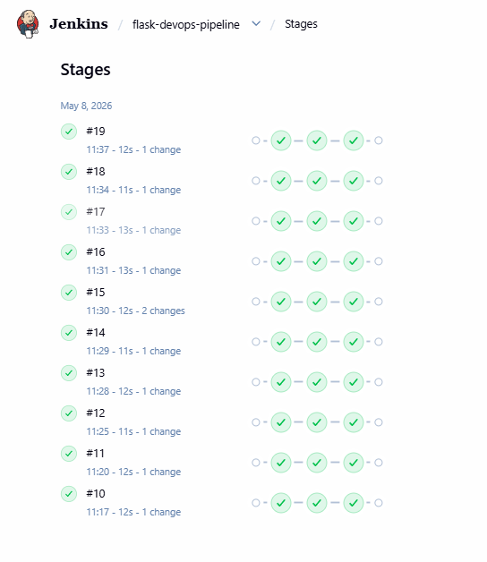
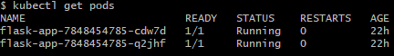
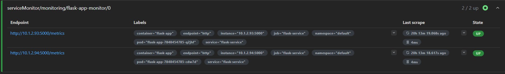
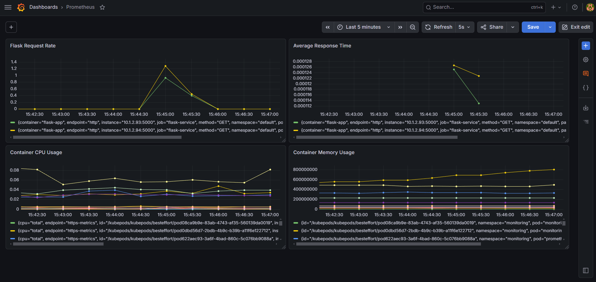

production-style cloud-native observability platform


# Cloud-Native Observability Platform

## Overview

This project demonstrates a cloud-native DevOps and observability platform built using Flask, Docker, Kubernetes, Prometheus, Grafana, and Jenkins.

The platform includes:
- Containerized Flask application
- CI/CD pipeline automation
- Kubernetes orchestration
- Prometheus metrics scraping
- Grafana monitoring dashboards
- Application-level observability

The goal of this project was to simulate a production-style deployment workflow while implementing modern monitoring and operational visibility practices.

---

# System Architecture

```text
User Requests
      ↓
Flask Application
      ↓
Docker Container
      ↓
Jenkins CI/CD Pipeline
      ↓
Kubernetes Deployment
      ↓
Prometheus Metrics Collection
      ↓
Grafana Dashboards
```

---

# Technologies Used

- Python
- Flask
- Docker
- Jenkins
- Kubernetes
- Prometheus
- Grafana
- Helm

---

# Features

- Containerized Flask web application
- Docker image build and deployment
- Jenkins CI/CD pipeline automation
- Kubernetes orchestration and scaling
- Prometheus metrics scraping
- Grafana observability dashboards
- Application health monitoring
- Real-time metrics visualization
- Kubernetes ServiceMonitor integration

---

# CI/CD Pipeline

The project includes a Jenkins-based CI/CD pipeline that automates:
- Docker image builds
- Kubernetes deployments
- Service updates

## Jenkins Pipeline Screenshot



---

# Kubernetes Deployment

The application is deployed into a Kubernetes cluster using:
- Deployments
- Services
- ReplicaSets
- ServiceMonitor resources

## Kubernetes Pods



---

# Observability & Monitoring

The platform includes a full observability stack using Prometheus and Grafana.

## Prometheus

Prometheus scrapes application metrics exposed through the `/metrics` endpoint using a Kubernetes ServiceMonitor.

Metrics collected include:
- HTTP request totals
- Request latency
- Python runtime metrics
- Container performance metrics
- Kubernetes workload metrics

## Prometheus Targets



---

# Grafana Dashboards

Grafana visualizes Prometheus metrics through operational dashboards.

Dashboards display:
- Request rates
- Response latency
- CPU utilization
- Memory utilization
- Kubernetes workload health

## Grafana Dashboard



---

# Application Metrics

The Flask application exposes Prometheus metrics through:

```text
/metrics
```

Example metrics include:

```text
flask_http_request_total
flask_http_request_duration_seconds
process_cpu_seconds_total
container_memory_usage_bytes
```

---

# Project Structure

```text
cloud-native-observability-platform/
│
├── app.py
├── requirements.txt
├── Dockerfile
├── deployment.yaml
├── service.yaml
├── flask-servicemonitor.yaml
├── Jenkinsfile
├── README.md
│
├── screenshots/
│   ├── grafana-dashboard.png
│   ├── prometheus-targets.png
│   ├── kubernetes-pods.png
│   └── jenkins-pipeline.png
│
└── docs/
```

---

# Deployment

## Build Docker Image

```bash
docker build -t flask-devops-app .
```

## Deploy to Kubernetes

```bash
kubectl apply -f deployment.yaml
kubectl apply -f service.yaml
```

## Deploy Monitoring

```bash
kubectl apply -f flask-servicemonitor.yaml
```

---

# Monitoring Stack

Prometheus and Grafana were installed using Helm charts.

## Install Prometheus & Grafana

```bash
helm repo add prometheus-community https://prometheus-community.github.io/helm-charts

helm repo update

helm install monitoring prometheus-community/kube-prometheus-stack -n monitoring --create-namespace
```

---

# Key Learning Outcomes

This project provided hands-on experience with:
- Containerization
- CI/CD automation
- Kubernetes orchestration
- Monitoring pipelines
- Metrics engineering
- Observability architecture
- Troubleshooting distributed systems
- Prometheus target discovery
- Grafana dashboard creation

---

# Future Improvements

Planned enhancements include:
- AWS EKS migration
- Terraform infrastructure provisioning
- GitHub Actions CI/CD
- Ingress controller integration
- Horizontal pod autoscaling
- Alerting integrations
- Distributed tracing
- AI-assisted anomaly detection

---

# Repository Purpose

This repository demonstrates practical experience with:
- Cloud-native application deployment
- Kubernetes platform operations
- Observability engineering
- Infrastructure automation
- Modern DevOps workflows

---

# Author

Moise Germain

````
